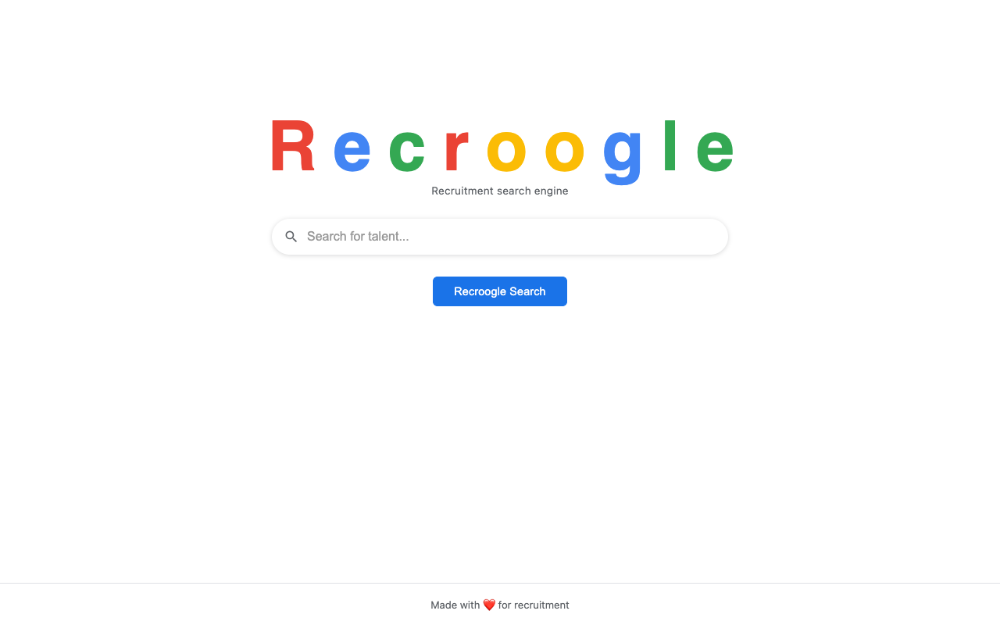

  

  <a href="https://recroogle.vercel.app/"><strong>recroogle.vercel.app</strong></a>

---

**Recroogle** is a playful search engine based on Google that always returns the same result — me. No matter what you search for, the answer is always the same: [**@eurafa**](https://github.com/eurafa).

This project is a lighthearted way to showcase my profile and hopefully help me land my next opportunity. It's not meant to be disrespectful to recruiters or the hiring process — quite the opposite. It's just a fun way to say *"hey, I'm here, and I'd love to talk."*
